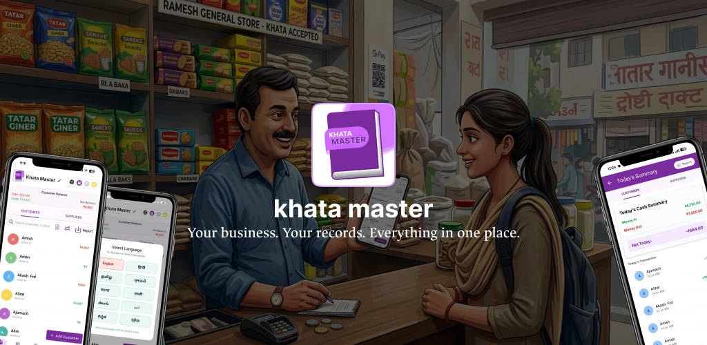
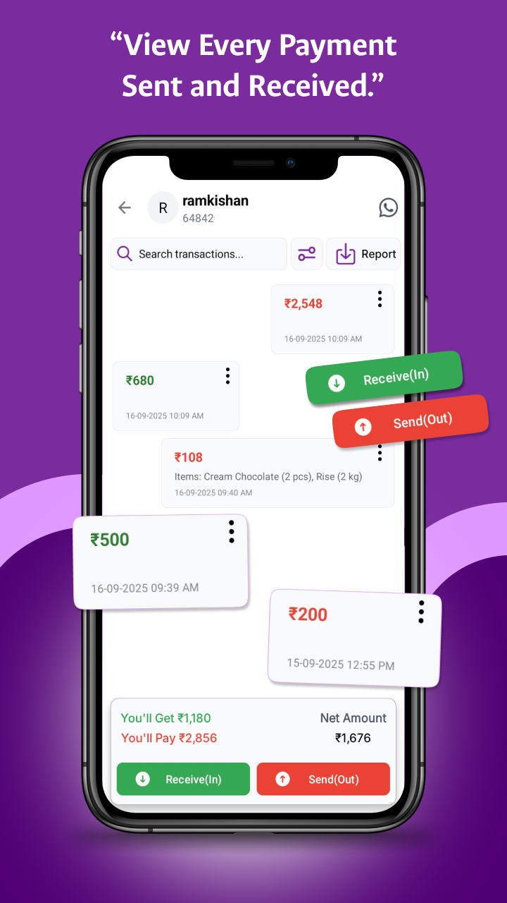
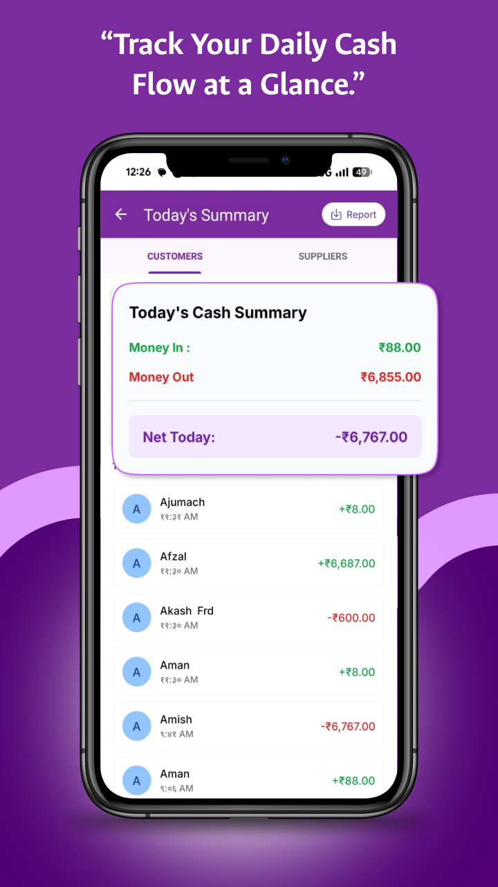
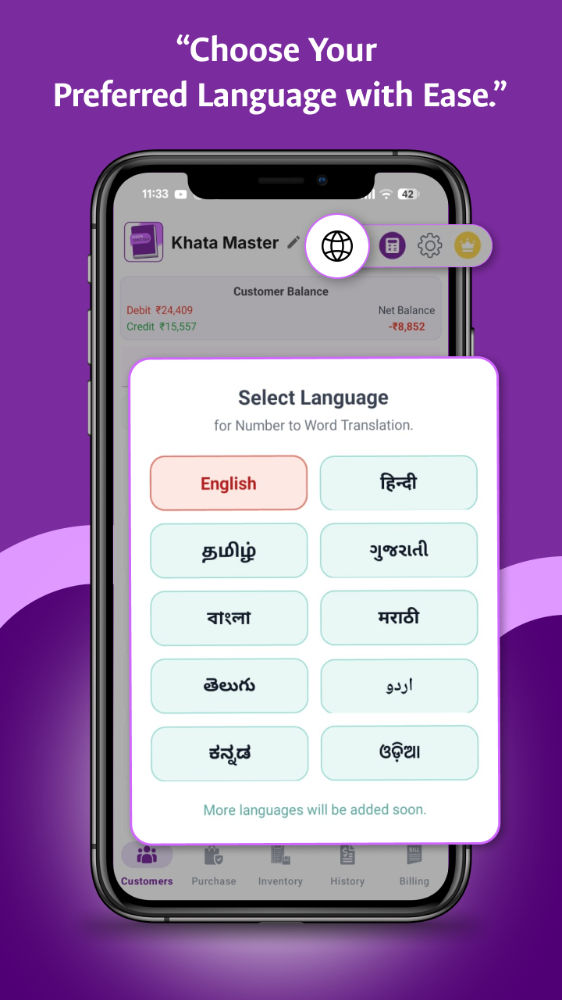
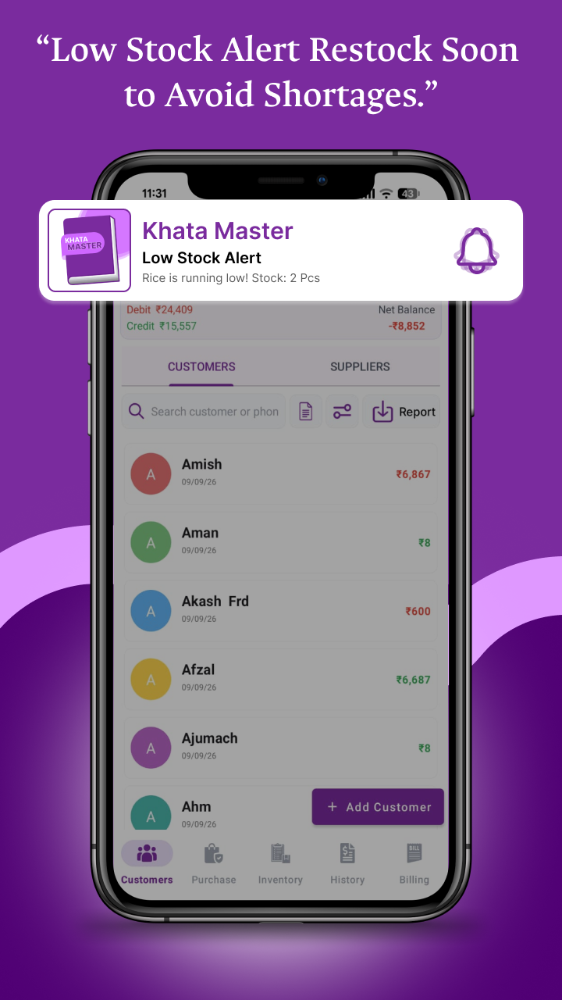

# Hi, I'm Vaidehi Virani 👋

### Android Developer · UI/UX Designer

I build simple, useful Android apps for small businesses, and I design them in Figma first.

---

## 🙋‍♀️ About Me

- 📱 I develop **Android apps** in **Java and Kotlin**
- 🎨 I design **UI/UX** in **Figma** following **Material Design**
- 🏪 I care about tools that help **shop owners and small businesses** go digital
- 🚀 My current project is **Khata Master** (v1.9), a digital khata book with suppliers, inventory, GST billing and cloud backup
- 📫 Reach me at **loveloop9055@gmail.com**

---

## 🛠️ Skills

| Area | Skills |
|---|---|
| **Mobile** | Android, Java, Kotlin, Android Studio |
| **Design** | Figma, Material Design, wireframing, prototyping |
| **Data** | Room (SQLite), Firebase |
| **Cloud** | Google Sign-In, Google Drive API backup and restore |
| **Android** | WorkManager, notifications, home screen widgets, biometric app lock |
| **Monetization** | Google Play Billing (subscriptions), AdMob |
| **App features** | PDF invoices and reports, multi-language support, search and filter, WhatsApp sharing |
| **Tools** | Git, GitHub, Google Play Console |

---

## 🌟 Featured Project

<table>
<tr>
<td width="120" valign="top">

</td>
<td valign="top">

### [Khata Master](README.md)

A digital khata book and udhar manager for small businesses.
**Live on the Google Play Store.**

- 📒 Customer **and supplier** ledgers with one-tap Receive (In) / Send (Out)
- 📅 Today's cash summary: Money In, Money Out, Net Today and profit
- 📦 Inventory with GST and low-stock notifications
- 🧾 Itemized PDF invoices with business logo and UPI ID
- ☁️ Google Drive and local backup, fingerprint app lock
- 🌐 Amounts in words in 10 Indian languages
- 📱 Home screen widget and Premium subscription

**My role:** Android Developer & UI/UX Designer (end-to-end design and development)
**Team:** Bhavin Mulani, Parth Kothiya

</td>
</tr>
</table>

---

## 🎨 Design Highlights

| Payments | Daily Summary | Languages | Low Stock Alert |
|:---:|:---:|:---:|:---:|
|  |  |  |  |

---

## 📈 What I'm Working On

- 🌐 Adding more languages to Khata Master
- 📊 More smart reports for shop owners
- ✨ Polishing the UI/UX with every release

---

## 🤝 Let's Connect

I'm open to **Android development** and **UI/UX design** collaborations.

📧 **loveloop9055@gmail.com**

⭐ *Thanks for visiting!*

