<div align="center">


# Khata Master

### Digital Khata Book · Udhar Manager · Inventory · GST Billing

A simple, all-in-one business app for small shops and traders to track udhar (credit),
manage stock, and generate PDF bills from a phone.

<a href="https://play.google.com/store/apps/details?id=com.khatamaster.khata.master">
  
</a>


</div>

---

## 📌 Table of Contents

- [About](#-about)
- [What's New](#-whats-new)
- [Features](#-features)
- [Screenshots](#-screenshots)
- [How It Works](#-how-it-works)
- [Who It's For](#-who-its-for)
- [Tech Stack](#%EF%B8%8F-tech-stack)
- [Roadmap](#-roadmap)
- [Team](#-team)
- [Contact](#-contact)

---

## 📖 About

**Khata Master** replaces the paper khata book with a smart digital ledger. It started as a
simple udhar tracker and now covers the everyday needs of a small business:

| 👥 Customers | 📦 Inventory | 🧾 History | 💳 Billing |
|:---:|:---:|:---:|:---:|
| Udhar ledger for every customer | Stock, price, GST and low-stock alerts | Invoice summary for all customers | Create and share PDF bills |

Everything is reachable from the four tabs on the bottom navigation bar.

---

## 🆕 What's New

The latest version adds these features:

- 📦 **Inventory management**: add items with price, unit (pcs, kg, …), stock, category and GST %
- ⚠️ **Low-stock alerts**: a colored stock bar turns **red** when an item drops below its alert level
- 🧮 **Automatic GST calculation**: base price, GST amount and total price are shown while you add an item
- 🧾 **Billing with PDF invoices**: pick a customer, select items with `+` / `–`, and generate a bill
- 📂 **Generated bills list**: search, **View** or **Download** every PDF bill, with item count, amount and date
- 📊 **Invoice history dashboard**: total amount and total customers at a glance
- 🔢 **Built-in calculator** on the home screen
- 🔍 **Search, filter and report export** on customer lists
- 💬 **WhatsApp sharing** from a customer's ledger
- 👑 **Premium** option in the header

---

## ✨ Features

<table>
<tr>
<td width="50%" valign="top">

### 📒 Digital Khata Book
- Separate ledger for every customer
- **You will Get / You will Pay / Net Balance** summary on the home screen
- Color-coded balances: 🟢 to receive, 🔴 to pay
- Chat-style transaction timeline grouped by *Yesterday* and *Today*

</td>
<td width="50%" valign="top">

### 💰 Udhar (Credit) Tracking
- **Receive (In)** and **Send (Out)** entries in one tap
- Add an amount with a category or remark
- Options menu (⋮) on every entry
- Share the account with customers on WhatsApp

</td>
</tr>
<tr>
<td valign="top">

### 📦 Inventory Management
- Item name, description, price and unit
- Initial stock and **low-stock alert** level
- Category and optional **GST %**
- Live price breakdown: base price, GST and total

</td>
<td valign="top">

### 🧾 Billing & Invoices
- Create a bill for any customer
- Select items from inventory with stock shown
- Automatic totals with GST
- Generate, view and download **PDF bills**

</td>
</tr>
<tr>
<td valign="top">

### 📊 Reports & History
- Invoice management dashboard
- Total amount and total customer count
- Download customer reports
- Search and filter customers

</td>
<td valign="top">

### ⚙️ Settings & More
- Built-in calculator
- Terms of Use and Privacy Policy
- Rate and Share the app
- Clean, purple Material Design interface

</td>
</tr>
</table>

---

## 📸 Screenshots

### Customers & Ledger

| Home | Add Customer | Customer Ledger |
|:---:|:---:|:---:|
| 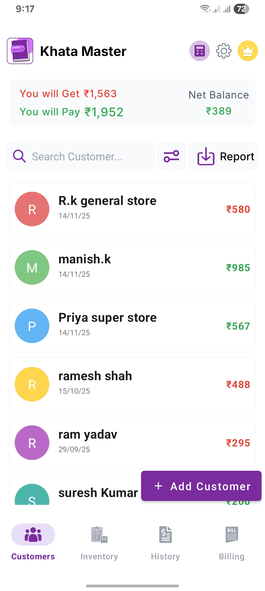 | 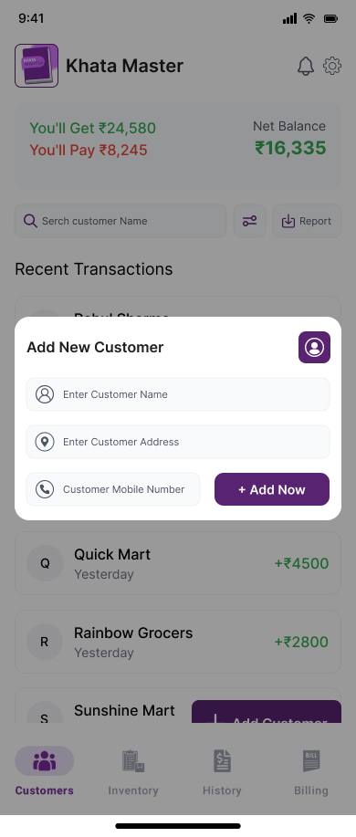 | 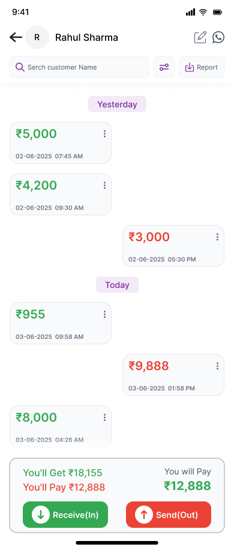 |

| Credit Receive | Debit Send | Settings |
|:---:|:---:|:---:|
| 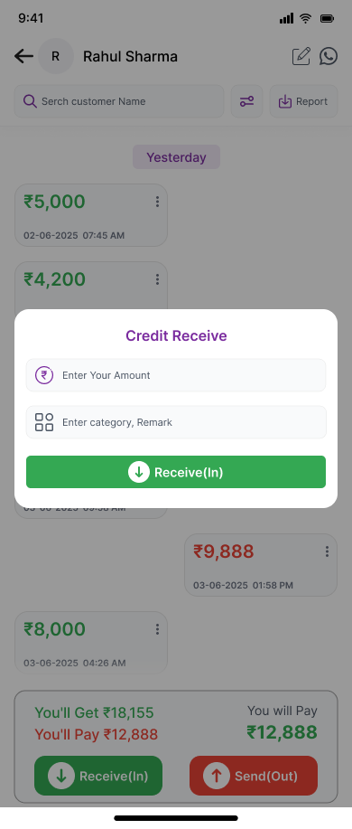 | 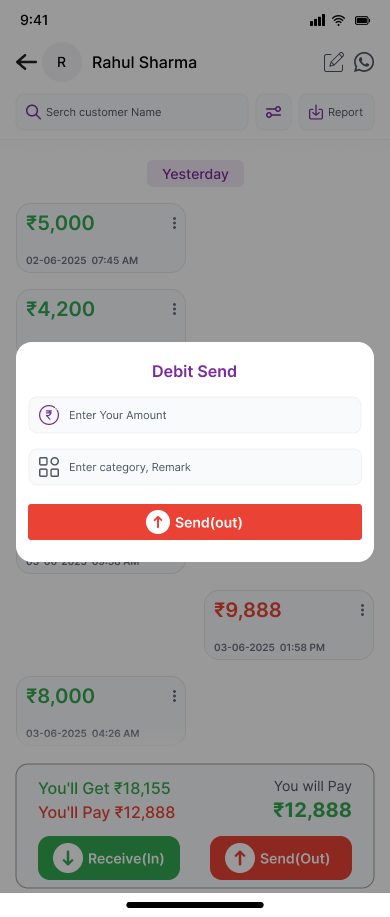 | 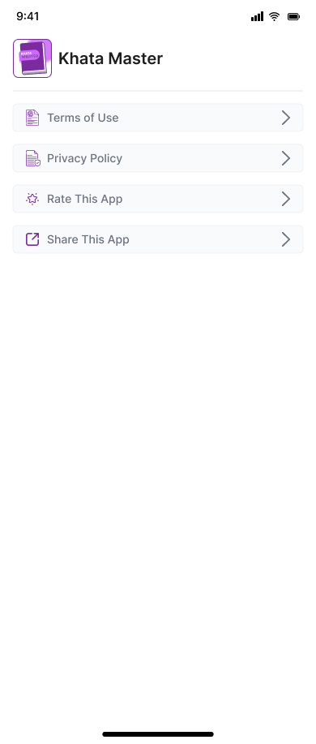 |

### Inventory, Billing & History

| Inventory | Create Item (GST) | Invoice History |
|:---:|:---:|:---:|
| 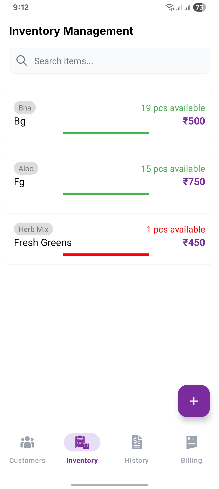 | 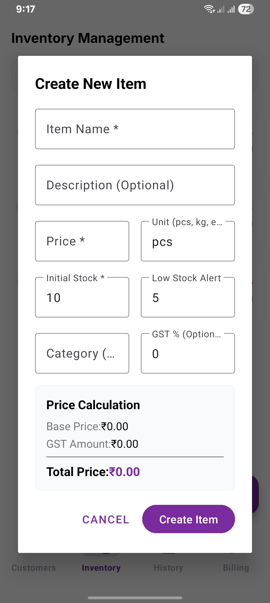 | 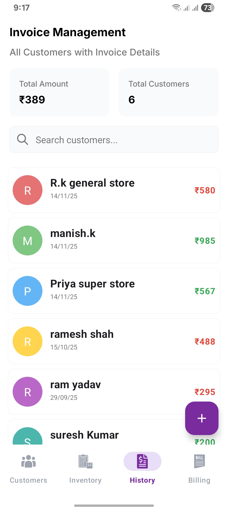 |

| Generated Bills | Select Bill Items | Splash |
|:---:|:---:|:---:|
| 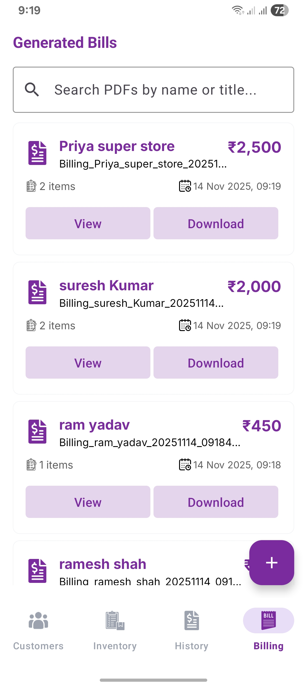 | 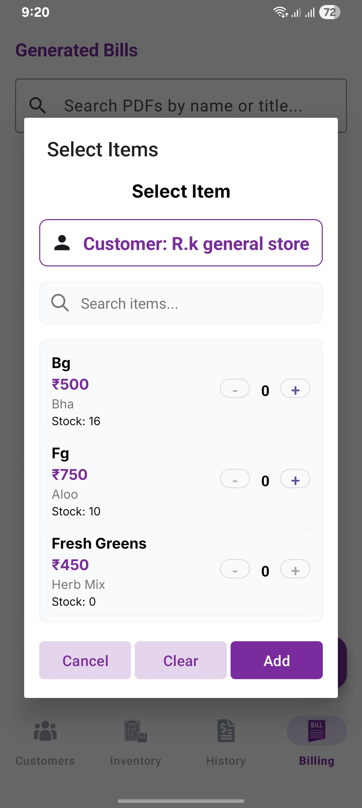 | 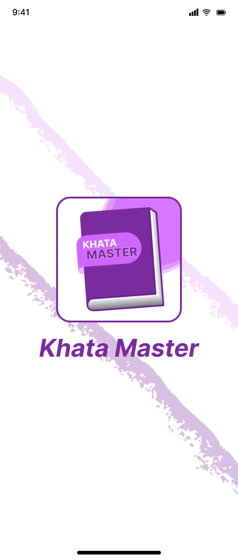 |

---

## 🔄 How It Works

```
1. Add a customer       →  name, address, mobile number
2. Record transactions  →  Receive (In) / Send (Out) with a remark
3. Add inventory items  →  price, stock, GST, low-stock alert
4. Create a bill        →  choose customer → select items → generate PDF
5. Track and share      →  view history, download reports, share on WhatsApp
```

---

## 🎯 Who It's For

| 🏪 Shop Owners | 🧾 Small Businesses | 📦 Traders |
|:---:|:---:|:---:|
| **🛍️ Retail Stores** | **💼 Freelancers** | **🧑‍🔧 Service Providers** |

---

## 🛠️ Tech Stack

| Area | Tools |
|---|---|
| 📱 Mobile development | Android (Java / Kotlin) |
| 🎨 UI/UX design | Figma, Material Design |
| 🗄️ Database | Local database / Firebase |
| 📄 Documents | PDF bill generation |

---

## 🚀 Roadmap

**Done**

- [x] Digital khata book and udhar tracking
- [x] Inventory management with low-stock alerts
- [x] GST calculation
- [x] PDF bill export
- [x] Business reports and invoice history

**Planned**

- [ ] Cloud backup
- [ ] Cloud sync across devices
- [ ] Multi-language support

---

## 👨‍💻 Team

| Role | Member |
|---|---|
| Android Developer & UI/UX Designer | **Vaidehi Virani** · [Profile](PROFILE.md) |
| Team Member | Bhavin Mulani |
| Team Member | Parth Kothiya |

---

## 📫 Contact

- 📧 Email: [loveloop9055@gmail.com](mailto:loveloop9055@gmail.com)
- 📲 Play Store: [Khata Master](https://play.google.com/store/apps/details?id=com.khatamaster.khata.master)

---

<div align="center">

### ⭐ If you find Khata Master useful, please give it a star!

**Paper khata → Smart khata.**

</div>
